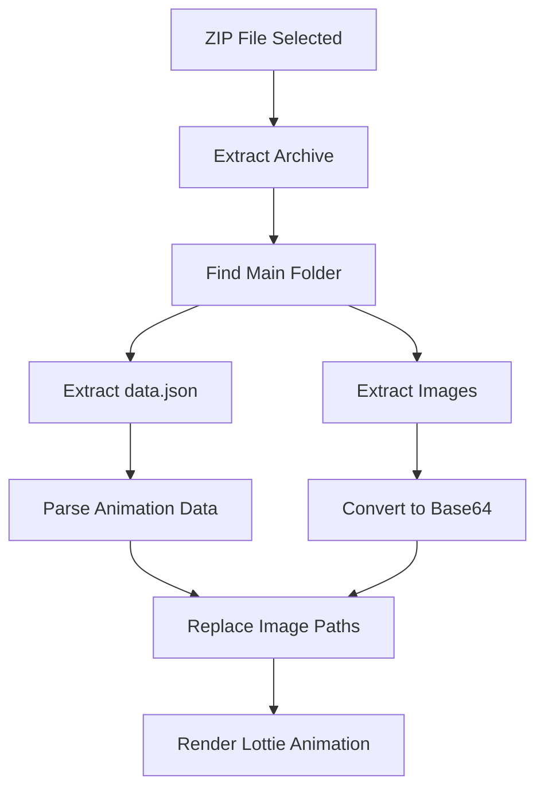

# 🎬 Lottie ZIP Demo

A Flutter demo application that extracts and previews Lottie animations from ZIP files with embedded images.


## 📱 Screenshots

| Upload Screen | File Info | Animation Preview |
|:-------------:|:---------:|:----------------:|
|  |  |  |

## 🎯 Features

- ✅ **ZIP File Upload**: Easy file picker integration
- ✅ **Automatic Extraction**: Finds and extracts animation folders automatically
- ✅ **Image Processing**: Converts images to base64 for Lottie compatibility
- ✅ **Live Preview**: Real-time animation playback with controls
- ✅ **Debug Information**: Shows expected vs found assets
- ✅ **Error Handling**: Comprehensive error messages and logging
- ✅ **Clean UI**: Material Design 3 interface

## 📁 Supported ZIP Structure

The app expects ZIP files with the following structure:

```
your-animation.zip
└── Frame16/                    # Main animation folder
    ├── data.json              # Lottie animation data
    ├── template.json          # Template configuration
    └── images/                # Image assets folder
        ├── img_0.jpg
        ├── img_1.jpg
        ├── img_2.jpg
        └── ...
```

## 🚀 Getting Started

### Prerequisites

- Flutter SDK (>=2.19.0)
- Dart SDK
- Android Studio / VS Code
- Device or Emulator

### Installation

1. **Clone or create the project:**
   ```bash
   flutter create lottie_zip_demo
   cd lottie_zip_demo
   ```

2. **Replace `pubspec.yaml` with:**
   ```yaml
   name: lottie_zip_demo
   description: A simple demo app to test Lottie ZIP file upload and preview

   version: 1.0.0+1

   environment:
     sdk: '>=2.19.0 <4.0.0'

   dependencies:
     flutter:
       sdk: flutter
     lottie: ^2.7.0
     file_picker: ^6.1.1
     archive: ^3.4.9
     path_provider: ^2.1.1

   dev_dependencies:
     flutter_test:
       sdk: flutter
     flutter_lints: ^3.0.0

   flutter:
     uses-material-design: true
   ```

3. **Replace `lib/main.dart` with the provided code**

4. **Install dependencies:**
   ```bash
   flutter pub get
   ```

5. **Run the app:**
   ```bash
   flutter run
   ```

## 📖 How to Use

### Step 1: Launch the App
- Open the app on your device or emulator
- You'll see the main upload screen

### Step 2: Upload ZIP File
- Tap **"Choose ZIP File"** button
- Select your Lottie animation ZIP file
- The app will automatically extract and process the contents

### Step 3: View File Information
- See extracted file details
- Browse image thumbnails
- Check debug information for asset matching

### Step 4: Preview Animation
- Watch the Lottie animation with embedded images
- Use playback controls:
    - ▶️ **Play** - Start animation
    - ⏸️ **Pause** - Pause animation
    - ⏹️ **Stop** - Stop and reset
    - 🔄 **Restart** - Restart from beginning

## 🔧 Technical Details

### Dependencies

| Package | Version | Purpose |
|---------|---------|---------|
| `lottie` | ^2.7.0 | Lottie animation rendering |
| `file_picker` | ^6.1.1 | File selection from device |
| `archive` | ^3.4.9 | ZIP file extraction |
| `path_provider` | ^2.1.1 | Temporary file storage |

### Key Components

#### 1. **ZIP Processing**
```dart
Future<void> _processZipFile(Uint8List zipBytes, String fileName)
```
- Extracts ZIP archive
- Finds main animation folder
- Processes JSON and image files

#### 2. **Image Conversion**
```dart
Map<String, dynamic> _replaceImagesInAnimationData()
```
- Converts images to base64 data URLs
- Replaces image paths in animation JSON
- Supports multiple image formats

#### 3. **Lottie Rendering**
```dart
Widget _buildLottieAnimation()
```
- Creates Lottie widget with modified data
- Handles animation lifecycle
- Provides error handling

## 🐛 Debugging

The app includes comprehensive debugging features:

### Console Logging
- File extraction progress
- Asset processing information
- Error details and stack traces

### Visual Debug Panel
- **Green indicators**: Assets found and matched
- **Red indicators**: Missing or mismatched assets
- File size information
- Asset name mapping

### Common Issues

| Issue | Cause | Solution |
|-------|--------|----------|
| Animation not loading | Invalid JSON format | Check data.json structure |
| Images not showing | Image path mismatch | Check debug panel for asset mapping |
| ZIP extraction fails | Unsupported ZIP structure | Ensure proper folder hierarchy |

## 📊 Performance

### Memory Usage
- Images are converted to base64 (increases size ~33%)
- Temporary files are cleaned up automatically
- Animation controllers are properly disposed

### Supported File Sizes
- **Recommended**: < 10MB ZIP files
- **Maximum**: Limited by device memory
- **Images**: JPEG, PNG, GIF, WebP formats

## 🏗️ Project Structure

```
lib/
├── main.dart                   # Main application entry point
└── (single file implementation)

Key Functions:
├── _pickZipFile()             # File picker integration
├── _processZipFile()          # ZIP extraction logic
├── _replaceImagesInAnimationData() # Image processing
├── _buildLottieAnimation()    # Animation rendering
└── UI Building Methods       # Various widget builders
```

## 🔄 Animation Data Flow



## 🎨 Customization

### UI Theming
- Material Design 3 components
- Customizable color scheme
- Responsive layout design

### Animation Controls
- Adjustable playback speed
- Loop control options
- Progress tracking

## 🚧 Known Limitations

- **Base64 Conversion**: Increases memory usage for large images
- **Single ZIP**: Processes one ZIP file at a time
- **Temporary Storage**: Requires device storage for extraction

## 🤝 Contributing

This is a demo project, but suggestions are welcome:

1. Fork the repository
2. Create your feature branch
3. Commit your changes
4. Push to the branch
5. Create a Pull Request

## 📄 License

This project is for demonstration purposes. Feel free to use and modify as needed.

## 🆘 Support

### Getting Help

- **Flutter Documentation**: [flutter.dev](https://flutter.dev)
- **Lottie Documentation**: [lottiefiles.com](https://lottiefiles.com/flutter)
- **Package Issues**: Check individual package repositories

### Troubleshooting

1. **Clean and rebuild:**
   ```bash
   flutter clean
   flutter pub get
   flutter run
   ```

2. **Check Flutter Doctor:**
   ```bash
   flutter doctor
   ```

3. **Enable verbose logging:**
   ```bash
   flutter run -v
   ```

## 📈 Version History

- **v1.0.0** - Initial release
    - Basic ZIP extraction
    - Lottie animation preview
    - Image processing
    - Debug information

## 🎯 Future Enhancements

Potential improvements for production use:

- [ ] **Multiple ZIP Support**: Handle multiple animation files
- [ ] **Image Optimization**: Compress images before conversion
- [ ] **Caching**: Store processed animations locally
- [ ] **Export Feature**: Save modified animations
- [ ] **Template Editing**: Allow runtime asset replacement
- [ ] **Performance Metrics**: Animation performance monitoring

---

## 💡 Pro Tips

1. **Optimize Images**: Use compressed JPEG/PNG for better performance
2. **Test Thoroughly**: Try different ZIP structures and sizes
3. **Monitor Memory**: Check device memory usage with large files
4. **Use Debug Panel**: Always check asset matching status

---

<div align="center">

**Happy Animating! 🎬✨**

Built with ❤️ using Flutter & Lottie

</div>